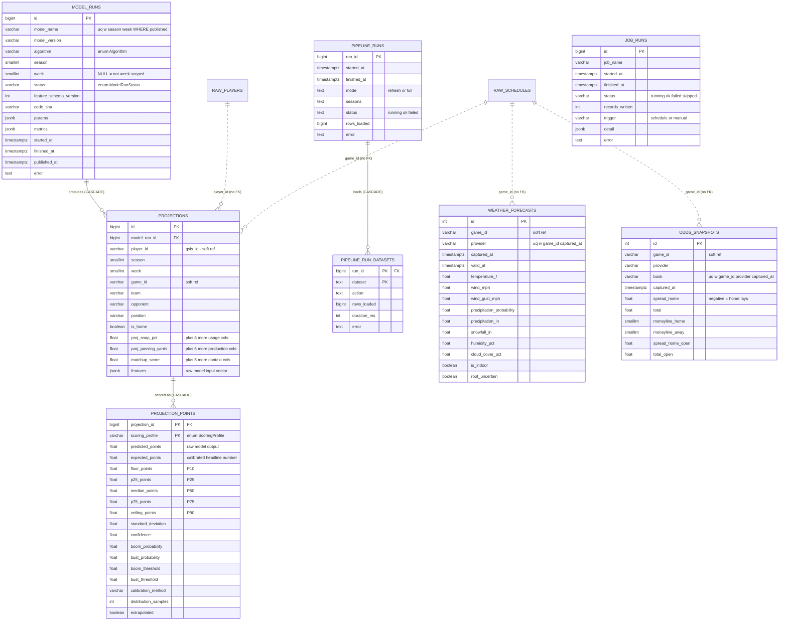

# Entity relationship diagram & data dictionary

The `nflfp` Postgres database holds three tiers of objects with **different
owners and different lifecycles**. This document covers all three, but the ERD
and the data dictionary describe the **application-owned** tier in full — the
eight tables Alembic versions and this application is responsible for.

| Tier | Objects | Owner | Lifecycle |
|---|---|---|---|
| Application | `model_runs`, `projections`, `projection_points`, `weather_forecasts`, `odds_snapshots`, `job_runs`, `pipeline_runs`, `pipeline_run_datasets` | Alembic | Versioned migrations |
| Warehouse | `raw_*` tables, `player_week` / `game_team` / `upcoming_games` views | `nflfp.pipeline`, `nflfp.transform` | DROP/RENAME-swapped from nflverse parquet every run |
| Features | `feat_*` materialized views | `nflfp.features` | Dropped and rebuilt after each load |

## The boundary that shapes the diagram

**There are no foreign keys from application tables into the warehouse.** A
`REFERENCES raw_players(gsis_id)` would either block the weekly table swap or be
destroyed by the `DROP TABLE ... CASCADE` that performs it. So `player_id`,
`game_id` and `team` are carried as nflverse **natural keys with no constraint**,
and referential drift is caught by a reconciliation job rather than by the
database. Those are the dotted edges below.

---

## ERD — application-owned tables

### Cardinalities at a glance

| Parent | Child | Cardinality | On delete | Why |
|---|---|---|---|---|
| `model_runs` | `projections` | 1 : N | CASCADE | Every projection carries the lineage of the run that made it |
| `projections` | `projection_points` | 1 : N (≤ 4) | CASCADE | One row per scoring format; components stay scoring-agnostic |
| `pipeline_runs` | `pipeline_run_datasets` | 1 : N | CASCADE | Per-dataset outcome inside one ETL run |

`job_runs` is intentionally parentless — it logs *any* scheduled job (provider
refreshes, feature builds, training), and its purpose is to answer "when did
this last succeed?" without depending on anything else.

### Why `projections` and `projection_points` are two tables

A projection has two independent axes. Its **components** (targets, carries,
yards, touchdowns, snap share) are facts about football and don't depend on
league rules. Its **points** exist once per scoring format.

Flattening them would store ~30 component columns four times over for a single
player-week, and would make "add TE-premium scoring" a data migration. Split,
a new format is a handful of rows in one narrow table.

### Publishing model

Projections are generated in advance; the API never invokes a model. A run
becomes visible by moving to `published`, and the partial unique index
`uq_model_runs_published` allows only **one** published run per
`(model_name, season, week)`. A rollout — and its rollback — is one `UPDATE`
inside a transaction, with the previous run still on disk.

---

# Data dictionary

Types are as declared in the ORM ([src/nflfp/db/models/](../src/nflfp/db/models/)).
`JSONB` degrades to `JSON` on non-Postgres engines; every `TIMESTAMPTZ` is
timezone-aware.

## `model_runs`

One execution of the prediction engine — the lineage record.

| Column | Type | Null | Default | Description |
|---|---|:--:|---|---|
| `id` | BIGINT | no | identity | Surrogate PK |
| `model_name` | VARCHAR(64) | no | — | Registered model identifier, e.g. `weekly_points`. Stable across versions |
| `model_version` | VARCHAR(32) | no | — | Version of that model, e.g. `2.1.0`. Bumped whenever output changes |
| `algorithm` | VARCHAR(32) | no | `baseline` | Estimator family. Lineage only — dispatch is on `model_name` |
| `season` | SMALLINT | no | — | NFL season |
| `week` | SMALLINT | yes | — | NULL for runs that are not week-scoped, such as a training job |
| `status` | VARCHAR(16) | no | `pending` | Lifecycle state. Only `published` is read by the API |
| `feature_schema_version` | INTEGER | no | `1` | Version of the feature contract. What makes `projections.features` interpretable after the feature set moves on |
| `code_sha` | VARCHAR(40) | yes | — | Git commit of the code that produced this run |
| `params` | JSONB | yes | — | Hyperparameters and configuration |
| `metrics` | JSONB | yes | — | Backtest/validation metrics, e.g. `{"mae": 4.1, "spearman": 0.62}` |
| `started_at` | TIMESTAMPTZ | yes | — | Run start |
| `finished_at` | TIMESTAMPTZ | yes | — | Run end |
| `published_at` | TIMESTAMPTZ | yes | — | When the run was promoted |
| `error` | TEXT | yes | — | Failure detail |
| `created_at` | TIMESTAMPTZ | no | `now()` | Row insert (server clock) |
| `updated_at` | TIMESTAMPTZ | no | `now()` | Row update (server clock) |

**Constraints**

| Name | Rule |
|---|---|
| `ck_model_runs_status_known` | `status IN ('pending','running','succeeded','failed','published','superseded')` |
| `ck_model_runs_season_plausible` | `season BETWEEN 1999 AND 2200` |
| `ck_model_runs_week_plausible` | `week IS NULL OR week BETWEEN 1 AND 25` |
| `ck_model_runs_finished_after_started` | `finished_at IS NULL OR started_at IS NULL OR finished_at >= started_at` |

**Indexes**

| Name | Definition | Serves |
|---|---|---|
| `uq_model_runs_published` | UNIQUE (`model_name`, `season`, `week`) WHERE `status = 'published'` | At most one live run per model-week; superseded/failed runs unconstrained |
| `ix_model_runs_season_week_status` | (`season`, `week`, `status`) | Resolving the published run for a slate |

## `projections`

A scoring-agnostic projection for one player in one week.

| Column | Type | Null | Description |
|---|---|:--:|---|
| `id` | BIGINT | no | Surrogate PK |
| `model_run_id` | BIGINT | no | → `model_runs.id`, ON DELETE CASCADE |
| `player_id` | VARCHAR(32) | no | nflverse `gsis_id`. Soft reference — no FK |
| `season` | SMALLINT | no | NFL season |
| `week` | SMALLINT | no | Week within the season |
| `game_id` | VARCHAR(32) | yes | nflverse game key. Soft reference |
| `team` | VARCHAR(8) | yes | Player's team abbreviation |
| `opponent` | VARCHAR(8) | yes | Opposing team abbreviation |
| `position` | VARCHAR(8) | yes | QB / RB / WR / TE |
| `is_home` | BOOLEAN | yes | Home-field flag |

**Projected usage** — usage is the signal: snap share correlates 0.62–0.71 with
weekly points and persists year over year at 0.63–0.73, while efficiency does
not (0.16–0.23). All FLOAT, all nullable.

| Column | Description |
|---|---|
| `proj_snap_pct` | Projected snap share, 0–1 fraction |
| `proj_target_share` | Projected team target share, 0–1 fraction |
| `proj_rush_share` | Projected team rush share, 0–1 fraction |
| `proj_redzone_touches` | Projected touches inside the 20 |
| `proj_team_plays` | Projected team plays — a pace proxy |
| `proj_targets` | Projected targets |
| `proj_receptions` | Projected receptions |
| `proj_carries` | Projected carries |
| `proj_pass_attempts` | Projected pass attempts |

**Projected production** — all FLOAT, all nullable.

| Column | Description |
|---|---|
| `proj_passing_yards` | Projected passing yards |
| `proj_passing_tds` | Projected passing touchdowns |
| `proj_interceptions` | Projected interceptions thrown |
| `proj_rushing_yards` | Projected rushing yards |
| `proj_rushing_tds` | Projected rushing touchdowns |
| `proj_receiving_yards` | Projected receiving yards |
| `proj_receiving_tds` | Projected receiving touchdowns |

**Context and adjustments** — stored as numbers, not as the letter grades and
prose the UI shows, so the thresholds behind "A−" live in exactly one place and
can change without a backfill.

| Column | Type | Null | Description |
|---|---|:--:|---|
| `matchup_score` | FLOAT | yes | 0–100, higher is a better matchup |
| `defense_rank_vs_position` | SMALLINT | yes | 1–32, 1 = toughest defence against this position |
| `injury_multiplier` | FLOAT | yes | Applied to projected usage. 1.0 = healthy, 0.0 = ruled out |
| `weather_multiplier` | FLOAT | yes | 1.0 = neutral conditions |
| `vegas_implied_total` | FLOAT | yes | Implied points for this player's team, from the market |
| `team_spread` | FLOAT | yes | Points this team is favoured by (sign-normalised) |
| `features` | JSONB | yes | The exact feature vector fed to the model. Schema-less by design; `model_runs.feature_schema_version` keeps it interpretable |
| `created_at` / `updated_at` | TIMESTAMPTZ | no | Server clock |

**Constraints**

| Name | Rule |
|---|---|
| `uq_projections_identity` | UNIQUE (`model_run_id`, `player_id`, `season`, `week`) |
| `ck_projections_week_plausible` | `week BETWEEN 1 AND 25` |
| `ck_projections_season_plausible` | `season BETWEEN 1999 AND 2200` |
| `ck_projections_snap_pct_fraction` | `proj_snap_pct BETWEEN 0 AND 1` (NULL-permissive) |
| `ck_projections_target_share_fraction` | `proj_target_share BETWEEN 0 AND 1` (NULL-permissive) |
| `ck_projections_matchup_score_range` | `matchup_score BETWEEN 0 AND 100` |
| `ck_projections_defense_rank_range` | `defense_rank_vs_position BETWEEN 1 AND 32` |
| `ck_projections_injury_multiplier_range` | `injury_multiplier BETWEEN 0 AND 1` |

**Indexes**

| Name | Columns | Serves |
|---|---|---|
| `ix_projections_slate` | (`season`, `week`, `position`) | Weekly rankings and position boards — the dominant read |
| `ix_projections_player_history` | (`player_id`, `season`, `week`) | A player's projection history |
| `ix_projections_game` | (`game_id`) | Everything in one game |
| `ix_projections_team_slate` | (`team`, `season`, `week`) | Team stacks |

## `projection_points`

Fantasy-point **distribution** for one projection under one scoring format.
The distribution is the point of this table, not the estimate: over 2024–25 at
50%+ snaps, tight ends finish under five points 48.5% of the time and wide
receivers 37.2%, against 10.1% for running backs. A single number can't express
that.

| Column | Type | Null | Default | Description |
|---|---|:--:|---|---|
| `projection_id` | BIGINT | no | — | PK part 1 → `projections.id`, ON DELETE CASCADE |
| `scoring_profile` | VARCHAR(32) | no | — | PK part 2. `standard` / `half_ppr` / `ppr` / `ppr_te_premium` |
| `predicted_points` | FLOAT | **no** | — | The model's raw output, before calibration. Kept for lineage; conditionally biased by construction because shrinkage trades bias for variance |
| `expected_points` | FLOAT | yes | — | Mean of the held-out outcome distribution — **the headline number**, and what a simulator should use. Conditional bias within ±0.15 pts across every band up to 20 |
| `floor_points` | FLOAT | yes | — | P10 |
| `p25_points` | FLOAT | yes | — | P25 |
| `median_points` | FLOAT | yes | — | P50 |
| `p75_points` | FLOAT | yes | — | P75 |
| `ceiling_points` | FLOAT | yes | — | P90 |
| `standard_deviation` | FLOAT | yes | — | SD of the held-out outcome distribution, for simulators wanting a moment rather than quantiles |
| `confidence` | FLOAT | yes | — | 0–1. How much information the model had, not how good it is |
| `boom_probability` | FLOAT | yes | — | P(points ≥ `boom_threshold`) |
| `bust_probability` | FLOAT | yes | — | P(points ≤ `bust_threshold`) |
| `boom_threshold` | FLOAT | yes | — | Position-dependent boom line. Stored because the probability is meaningless without it — the unit on the measurement |
| `bust_threshold` | FLOAT | yes | — | Position-dependent bust line |
| `calibration_method` | VARCHAR(48) | yes | — | How the distribution was produced, e.g. `heldout_residual_quantiles_v1`. Per row, so a projection stays interpretable after the method changes |
| `distribution_samples` | INTEGER | yes | — | Held-out residuals behind this distribution. The honesty flag: a wide interval from 40 observations is not the same claim as one from 4,000 |
| `extrapolated` | BOOLEAN | no | `false` | True when the projection exceeded anything seen when fitting |
| `created_at` | TIMESTAMPTZ | no | `now()` | Row insert |

**Constraints** — the percentile chain is asserted end to end *and* directly,
because every link is NULL-permissive: with the quartiles absent, the chained
constraints all evaluate to NULL and a reversed floor/median/ceiling would slip
through.

| Name | Rule |
|---|---|
| `ck_projection_points_scoring_profile_known` | `scoring_profile IN ('standard','half_ppr','ppr','ppr_te_premium')` |
| `ck_projection_points_p10_le_p25` | `floor_points <= p25_points` |
| `ck_projection_points_p25_le_p50` | `p25_points <= median_points` |
| `ck_projection_points_p50_le_p75` | `median_points <= p75_points` |
| `ck_projection_points_p75_le_p90` | `p75_points <= ceiling_points` |
| `ck_projection_points_floor_le_median` | `floor_points <= median_points` (gap-closer) |
| `ck_projection_points_median_le_ceiling` | `median_points <= ceiling_points` (gap-closer) |
| `ck_projection_points_standard_deviation_non_negative` | `standard_deviation >= 0` |
| `ck_projection_points_confidence_range` | `confidence BETWEEN 0 AND 1` |
| `ck_projection_points_boom_probability_range` | `boom_probability BETWEEN 0 AND 1` |
| `ck_projection_points_bust_probability_range` | `bust_probability BETWEEN 0 AND 1` |

All rules above are NULL-permissive (`X IS NULL OR ...`).

**Indexes**

| Name | Definition | Serves |
|---|---|---|
| `ix_projection_points_ranking` | (`scoring_profile`, `predicted_points DESC`) | Rankings sort by points within a format without a full-slate sort |

## `weather_forecasts`

One forecast capture for one game. **Append-only** — a forecast three days out
differs from Sunday morning's, and forecast revision is itself a predictive
feature. Indoor games get a row too, with `is_indoor` set and neutral values,
so the feature layer can join without special-casing ~30% of the slate into
NULLs.

| Column | Type | Null | Default | Description |
|---|---|:--:|---|---|
| `id` | INTEGER | no | identity | Surrogate PK |
| `game_id` | VARCHAR(32) | no | — | nflverse game key. Soft reference |
| `provider` | VARCHAR(32) | no | — | Forecast source |
| `captured_at` | TIMESTAMPTZ | no | — | When the forecast was produced — what makes this a snapshot |
| `valid_at` | TIMESTAMPTZ | no | — | The kickoff hour it describes |
| `temperature_f` | FLOAT | yes | — | Degrees Fahrenheit |
| `wind_mph` | FLOAT | yes | — | Sustained wind |
| `wind_gust_mph` | FLOAT | yes | — | Gust speed |
| `precipitation_probability` | FLOAT | yes | — | 0–100 |
| `precipitation_in` | FLOAT | yes | — | Accumulation, inches |
| `snowfall_in` | FLOAT | yes | — | Accumulation, inches |
| `humidity_pct` | FLOAT | yes | — | Relative humidity |
| `cloud_cover_pct` | FLOAT | yes | — | Cloud cover |
| `is_indoor` | BOOLEAN | no | `false` | Dome or closed roof |
| `roof_uncertain` | BOOLEAN | no | `false` | Retractable roof whose state isn't known before kickoff |
| `created_at` | TIMESTAMPTZ | no | `now()` | Row insert |

**Constraints & indexes**

| Name | Rule / definition |
|---|---|
| `uq_weather_forecasts_capture` | UNIQUE (`game_id`, `provider`, `captured_at`) — makes a re-run idempotent instead of doubling history |
| `ix_weather_forecasts_latest` | (`game_id`, `captured_at DESC`) — serves the `DISTINCT ON (game_id)` that resolves "latest forecast" |
| `ck_weather_forecasts_temperature_plausible` | `temperature_f BETWEEN -60 AND 130` |
| `ck_weather_forecasts_wind_plausible` | `wind_mph BETWEEN 0 AND 120` |
| `ck_weather_forecasts_precip_probability_range` | `precipitation_probability BETWEEN 0 AND 100` |

## `odds_snapshots`

One market capture for one game from one sportsbook. **Append-only** — a market
moves all week on injury news, and line movement is itself predictive.

Implied team totals are *derived, not stored*: they're exactly
`total/2 ∓ spread/2`, and storing a derivable value is how two columns end up
disagreeing.

| Column | Type | Null | Default | Description |
|---|---|:--:|---|---|
| `id` | INTEGER | no | identity | Surrogate PK |
| `game_id` | VARCHAR(32) | no | — | nflverse game key. Soft reference |
| `provider` | VARCHAR(32) | no | — | Feed, e.g. `espn` |
| `book` | VARCHAR(48) | no | — | Sportsbook, e.g. `DraftKings` |
| `captured_at` | TIMESTAMPTZ | no | — | Capture instant |
| `spread_home` | FLOAT | yes | — | Market convention: negative means the home team lays points |
| `total` | FLOAT | yes | — | Game total (over/under) |
| `moneyline_home` | SMALLINT | yes | — | American odds |
| `moneyline_away` | SMALLINT | yes | — | American odds |
| `spread_home_open` | FLOAT | yes | — | Opening spread, for line-movement features |
| `total_open` | FLOAT | yes | — | Opening total |
| `created_at` | TIMESTAMPTZ | no | `now()` | Row insert |

**Constraints & indexes**

| Name | Rule / definition |
|---|---|
| `uq_odds_snapshots_capture` | UNIQUE (`game_id`, `provider`, `book`, `captured_at`) |
| `ix_odds_snapshots_latest` | (`game_id`, `captured_at DESC`) |
| `ck_odds_snapshots_spread_plausible` | `spread_home BETWEEN -30 AND 30` |
| `ck_odds_snapshots_total_plausible` | `total BETWEEN 20 AND 80` |

## `job_runs`

One execution of a registered scheduled job — provider refreshes, feature
builds, and later model training. Separate from `pipeline_runs`, which records
nflverse loads specifically.

| Column | Type | Null | Default | Description |
|---|---|:--:|---|---|
| `id` | BIGINT | no | identity | Surrogate PK |
| `job_name` | VARCHAR(64) | no | — | Registered job identifier |
| `started_at` | TIMESTAMPTZ | no | `now()` | Job start |
| `finished_at` | TIMESTAMPTZ | yes | — | Job end |
| `status` | VARCHAR(16) | no | `running` | `running` / `ok` / `failed` / `skipped` |
| `records_written` | INTEGER | no | `0` | Rows the job persisted |
| `trigger` | VARCHAR(16) | no | `manual` | `schedule` or `manual` — distinguishes a cron run from a human rerun |
| `detail` | JSONB | yes | — | Per-job summary: counts, skipped games, provider warnings |
| `error` | TEXT | yes | — | Failure detail |

`duration_seconds` is a Python property on the ORM model, not a column.

**Constraints & indexes**

| Name | Rule / definition |
|---|---|
| `ck_job_runs_status_known` | `status IN ('running','ok','failed','skipped')` |
| `ck_job_runs_finished_after_started` | `finished_at IS NULL OR finished_at >= started_at` |
| `ix_job_runs_name_started` | (`job_name`, `started_at DESC`) — serves "when did this job last succeed?", the question failure recovery is built on |

## `pipeline_runs`

One execution of `python -m nflfp.pipeline`.

> These two tables are created **imperatively** by `nflfp.warehouse.ensure_run_log`
> as well as by Alembic. Deliberate: the Railway cron image runs the pipeline and
> exits, and making a data load depend on Alembic being installed and current
> would couple a job that must keep working to a migration chain it has no
> business knowing about. The baseline migration *adopts* the tables if present
> rather than recreating them. `tests/test_models.py` asserts the ORM mapping
> matches the live schema column for column.

| Column | Type | Null | Default | Description |
|---|---|:--:|---|---|
| `run_id` | BIGINT | no | `BIGSERIAL` | Surrogate PK |
| `started_at` | TIMESTAMPTZ | no | `now()` | Run start |
| `finished_at` | TIMESTAMPTZ | yes | — | Run end |
| `mode` | TEXT | no | — | `refresh` or `full` |
| `seasons` | TEXT | yes | — | Season list or range covered, as displayed |
| `status` | TEXT | no | `running` | `running` / `ok` / `failed` |
| `rows_loaded` | BIGINT | no | `0` | Total rows across all datasets |
| `error` | TEXT | yes | — | Failure detail |

**Index:** `pipeline_runs_started_idx` on (`started_at DESC`).

## `pipeline_run_datasets`

Per-dataset outcome within one pipeline run.

| Column | Type | Null | Default | Description |
|---|---|:--:|---|---|
| `run_id` | BIGINT | no | — | PK part 1 → `pipeline_runs.run_id`, ON DELETE CASCADE |
| `dataset` | TEXT | no | — | PK part 2. Dataset name, e.g. `player_week` |
| `action` | TEXT | no | — | `swap`, `skipped`, or a `replaced N rows` note |
| `rows_loaded` | BIGINT | no | `0` | Rows landed for this dataset |
| `duration_ms` | INTEGER | no | `0` | Wall time for this dataset |
| `error` | TEXT | yes | — | Failure detail |

---

# Metadata reference

## Enumerations

Stored as `TEXT` with a `CHECK` constraint rather than native Postgres `ENUM`
types: adding a value to a native enum requires `ALTER TYPE`, which can't run
inside a transaction alongside other DDL on older servers, and removing one
isn't supported at all. A `CHECK` is a plain, reversible migration.

Defined in [db/enums.py](../src/nflfp/db/enums.py).

| Enum | Used by | Values |
|---|---|---|
| `ModelRunStatus` | `model_runs.status` | `pending`, `running`, `succeeded`, `failed`, `published`, `superseded` |
| `Algorithm` | `model_runs.algorithm` | `baseline`, `ridge`, `random_forest`, `xgboost`, `lightgbm`, `neural_net`, `ensemble` |
| `ScoringProfile` | `projection_points.scoring_profile` | `standard`, `half_ppr`, `ppr`, `ppr_te_premium` |
| `SeasonType` | nflverse `season_type` | `REG`, `POST` |
| (literal) | `job_runs.status` | `running`, `ok`, `failed`, `skipped` |
| (literal) | `job_runs.trigger` | `schedule`, `manual` |
| (literal) | `pipeline_runs.status` | `running`, `ok`, `failed` |
| (literal) | `pipeline_runs.mode` | `refresh`, `full` |

`ScoringProfile` mirrors the keys of `nflfp.scoring.PROFILES`, which remains the
single definition of the rules themselves; `tests/test_enums.py` fails if the
two drift apart. `nflverse_parity` is intentionally absent — it's a regression
fixture for the scoring maths, not a format anyone plays.

## Naming conventions

`Base.metadata` carries a naming convention so Postgres never invents a
constraint name (which would leave Alembic downgrades unable to find the
constraint they're meant to drop). Defined in [db/base.py](../src/nflfp/db/base.py).

| Kind | Template | Example |
|---|---|---|
| Index | `ix_%(table_name)s_%(column_0_N_name)s` | *(every index here is named explicitly instead, e.g. `ix_projections_slate`)* |
| Unique | `uq_%(table_name)s_%(column_0_N_name)s` | *(named explicitly, e.g. `uq_projections_identity`)* |
| Check | `ck_%(table_name)s_%(constraint_name)s` | `ck_projections_week_plausible` |
| Foreign key | `fk_%(table_name)s_%(column_0_name)s_%(referred_table_name)s` | `fk_projections_model_run_id_model_runs` |
| Primary key | `pk_%(table_name)s` | `pk_projections` |

## Keys

Primary and foreign keys are named by the convention above rather than left to
Postgres. The full set:

| Table | Primary key | Columns | Foreign keys |
|---|---|---|---|
| `model_runs` | `pk_model_runs` | (`id`) | — |
| `projections` | `pk_projections` | (`id`) | `fk_projections_model_run_id_model_runs` → `model_runs.id` CASCADE |
| `projection_points` | `pk_projection_points` | (`projection_id`, `scoring_profile`) | `fk_projection_points_projection_id_projections` → `projections.id` CASCADE |
| `weather_forecasts` | `pk_weather_forecasts` | (`id`) | — |
| `odds_snapshots` | `pk_odds_snapshots` | (`id`) | — |
| `job_runs` | `pk_job_runs` | (`id`) | — |
| `pipeline_runs` | `pk_pipeline_runs` | (`run_id`) | — |
| `pipeline_run_datasets` | `pk_pipeline_run_datasets` | (`run_id`, `dataset`) | `fk_pipeline_run_datasets_run_id_pipeline_runs` → `pipeline_runs.run_id` CASCADE |

Three foreign keys total — every other cross-table link is a soft reference by
natural key, for the reason given at the top of this document.

## Shared column semantics

| Column | Appears in | Meaning |
|---|---|---|
| `player_id` | `projections` | nflverse `gsis_id`. Soft reference to `raw_players.gsis_id` — no FK |
| `game_id` | `projections`, `weather_forecasts`, `odds_snapshots` | nflverse game key. Soft reference to `raw_schedules.game_id` — no FK |
| `team`, `opponent` | `projections` | nflverse team abbreviation |
| `season` | `model_runs`, `projections` | NFL season year; the league year rolls over in March |
| `week` | `model_runs`, `projections` | 1–25, spanning regular season and postseason |
| `captured_at` | `weather_forecasts`, `odds_snapshots` | Snapshot instant. What makes these tables append-only history |
| `created_at` / `updated_at` | all application tables | Maintained by the **database** clock via server defaults, because rows are also written by the ETL and by ad-hoc SQL — a timestamp that only appears when the ORM is in the call path is worse than none |

## Migration history

| Revision | File | Adds |
|---|---|---|
| baseline | `20260807_0001_baseline_app_tables.py` | `model_runs`, `projections`, `projection_points`; adopts `pipeline_runs`, `pipeline_run_datasets` if present |
| `8bd687fede06` | `20260807_1722_..._provider_snapshots_and_job_runs.py` | `weather_forecasts`, `odds_snapshots`, `job_runs` |
| `f453f4de885f` | `20260807_2219_..._distribution_percentiles_and_.py` | `expected_points`, `p25_points`, `p75_points`, `standard_deviation`, `calibration_method`, `distribution_samples`, `extrapolated` on `projection_points`; replaces the ordering checks with the full P10→P90 chain |

---

# Context: objects outside the ERD

These are **not** application-owned, are not mapped in `db/base.py`, and are
invisible to Alembic autogenerate — mapping them would make autogenerate emit
migrations that drop or alter tables out from under the weekly load.

## Warehouse tables — owned by `nflfp.pipeline`

DROP/RENAME-swapped from nflverse parquet each run; columns follow the upstream
feed. Indexes are declared in `nflfp.warehouse.INDEXES` and created only if
every column actually exists, because nflverse changes schemas between seasons.

| Table | Contents |
|---|---|
| `raw_player_week` | Weekly per-player box score + EPA/share metrics — the target variable lives here |
| `raw_schedules` | Game-level context: home/away, spread, total, roof, surface, temp, wind, rest days |
| `raw_players` | Player dimension; bridges `gsis_id` ↔ `pfr_id` |
| `raw_snap_counts` | Snap counts, keyed on `pfr_player_id` |
| `raw_injuries` | Weekly injury designations |
| `raw_rosters` | Season rosters |
| `raw_teams` | Team dimension |
| `raw_depth_charts` | Depth chart positions |

## Derived views — owned by `nflfp.transform`

Dropped and recreated on every publish. Everything is a VIEW, not a table: the
`raw_*` tables are the only materialised state, so re-shaping the model layer
costs nothing and can't drift out of sync with an ingest.

| View | Contents |
|---|---|
| `game_team` | One row per (game, team) — the team-perspective schedule. Normalises nflverse's home-signed `spread_line` into `team_spread` ("points THIS team is favoured by") and derives `implied_team_total` / `implied_opp_total` |
| `upcoming_games` | `game_team` rows with no result yet — what you actually need to project |
| `player_week` | Player-week fact joined to game context, snaps and injury designation, with `fp_*` columns per scoring profile |

## Feature materialized views — owned by `nflfp.features`

| View | Depends on |
|---|---|
| `feat_player_usage` | `player_week` |
| `feat_game_context` | `game_team`, `odds_snapshots`, `weather_forecasts` |
| `feat_defense_game` | `player_week` |
| `feat_defense_position` | `player_week` |
| `feat_defense_rolling` | `feat_defense_game` |
| `feat_defense_position_rolling` | `feat_defense_position` |
| `feat_training_dataset` | `feat_player_usage`, `feat_game_context`, `feat_defense_position_rolling`, `feat_defense_rolling` |

`feat_defense_game` is a same-week aggregate and is **not** safe to feed a
model directly; the `_rolling` views apply the lag. The prediction engine reads
`feat_training_dataset` and nothing below it.

---

*Generated from the ORM models in [src/nflfp/db/models/](../src/nflfp/db/models/).
When a model changes, this document should change with it.*
